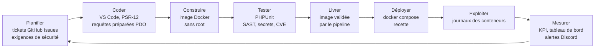
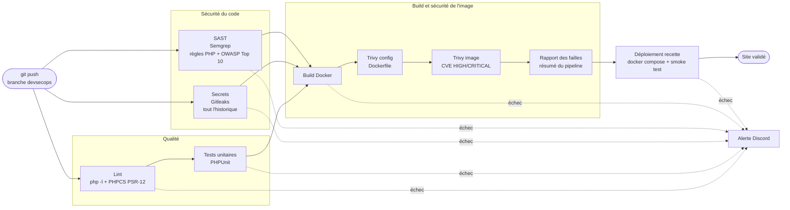

# Module 1 — Schéma du pipeline DevSecOps de TomTroc

Projet livré : **TomTroc** (application web PHP 8.2 / MariaDB, architecture MVC).
Outil CI/CD : **GitHub Actions** (accepté par l'enseignant à la place de Jenkins ou GitLab CI).
Le pipeline est décrit dans [.github/workflows/pipeline.yml](../../.github/workflows/pipeline.yml) et tourne sur la branche `devsecops`.

## 1. Le processus DevSecOps complet

La sécurité n'est pas une étape finale : elle intervient à chaque phase de la boucle DevOps.

## 2. Le pipeline CI/CD

Règles du pipeline :

- **Échec rapide** : lint, recherche de secrets et SAST tournent en parallèle dès le push ; un job en échec bloque la suite.
- **Barrières de sécurité bloquantes** : un secret dans l'historique, une faille Semgrep, une mauvaise configuration du Dockerfile ou une CVE HIGH/CRITICAL corrigeable arrêtent le pipeline : l'image n'est pas déployée.
- **Chaîne d'approvisionnement** : actions GitHub épinglées par empreinte SHA, images d'outils en version fixe (pas de `latest`), droits du pipeline limités à la lecture (`permissions: contents: read`).
- **Aucun secret dans le dépôt** : `.env` non versionné ; en recette, les mots de passe de la base sont générés à chaque déploiement ; l'adresse du webhook Discord est un secret GitHub.

## 3. Choix et justification des outils

| Étape | Outil retenu | Pourquoi | Alternatives étudiées |
|---|---|---|---|
| Orchestration CI/CD | **GitHub Actions** | dépôt déjà sur GitHub, aucun serveur à installer ni maintenir, runners gratuits | Jenkins (serveur et plugins à maintenir), GitLab CI (migration du dépôt) |
| Lint | **php -l**, **PHP_CodeSniffer** (PSR-12) | syntaxe et norme de codage PHP officielle | PHP-CS-Fixer |
| Tests | **PHPUnit 11** | standard des tests unitaires PHP | Pest |
| Secrets | **Gitleaks** | analyse tout l'historique Git, rapide, open source | TruffleHog, GitHub secret scanning |
| SAST | **Semgrep** (règles `p/php`, `p/owasp-top-ten`) | sans serveur, règles OWASP prêtes à l'emploi, résultat en quelques secondes | SonarQube (serveur à héberger, plus complet sur la qualité), Snyk Code (compte requis) |
| Conteneurisation | **Docker**, **docker compose** | même environnement en local, en CI et en recette | Podman |
| Scan d'image et IaC | **Trivy** (`config` et `image`) | un seul outil pour le Dockerfile et les CVE des paquets, base de failles à jour | Snyk Container, Grype |
| Déploiement | **docker compose** sur le runner (recette éphémère) | décision du TP : déploiement Docker ; teste le vrai site avec sa base | VM, Kubernetes |
| Notification | **Webhook Discord** | gratuit, alerte immédiate de l'équipe | Slack, e-mail (notification native de GitHub) |
| Métriques | **API GitHub Actions** + [scripts/kpi.py](../../scripts/kpi.py) | données réelles du pipeline, sans outil supplémentaire | Prometheus + Grafana |
| Secrets d'exécution | **GitHub Secrets** | chiffrés, masqués dans les journaux | HashiCorp Vault (prévu dans la feuille de route si plusieurs environnements) |
