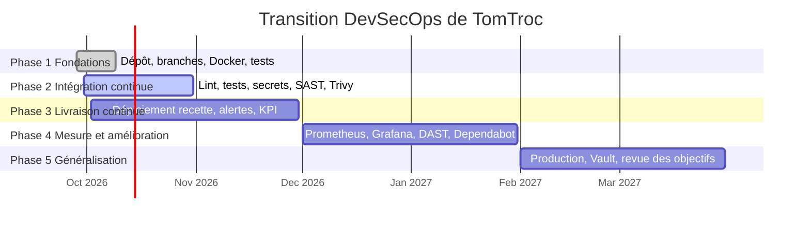

# Module 3 — Indicateurs et feuille de route DevSecOps

## 1. Les indicateurs retenus

Les quatre premiers sont les indicateurs **DORA** (recherche *Accelerate*, Google DORA), la référence pour mesurer la performance d'une équipe DevOps : deux mesurent la **vitesse** (fréquence, délai), deux la **stabilité** (taux d'échec, rétablissement). Les deux derniers sont propres au pipeline et à la sécurité.

| # | Indicateur | Définition et calcul | Objectif | Pourquoi |
|---|---|---|---|---|
| 1 | **Fréquence de déploiement** | nombre de jobs « Déploiement » réussis par semaine | ≥ 3 / semaine | livrer souvent = petits changements, moins risqués |
| 2 | **Délai de mise en production** (*lead time for changes*) | médiane du temps entre le commit et la fin du déploiement | < 30 min | mesure la fluidité de toute la chaîne |
| 3 | **Taux d'échec des changements** | push dont le pipeline échoue ÷ nombre total de push | < 15 % | qualité de ce qui est envoyé dans le pipeline |
| 4 | **Temps moyen de rétablissement** (MTTR) | moyenne du temps entre un pipeline en échec et le prochain pipeline réussi | < 60 min | capacité à corriger vite |
| 5 | **Durée du pipeline** | médiane du temps d'une exécution réussie | < 10 min | un pipeline lent est contourné par les développeurs |
| 6 | **Failles HIGH/CRITICAL de l'image** + exécutions bloquées par un contrôle de sécurité | nombre de CVE de l'image (rapport Trivy) ; nombre d'exécutions arrêtées par Gitleaks, Semgrep ou Trivy | 0 faille corrigeable | dette de sécurité et efficacité des barrières |

Indicateurs écartés : la couverture de code (un seul fichier de tests pour l'instant, la valeur ne serait pas représentative) et la disponibilité en production (pas d'environnement de production permanent).

## 2. Comment les mesures sont collectées

- **Pendant le pipeline** : l'étape « Compter toutes les failles de l'image » publie le nombre de CVE par gravité dans le résumé de chaque exécution (onglet *Summary* de GitHub Actions). Le job de déploiement utilise l'environnement GitHub `recette` : chaque déploiement est enregistré dans l'onglet *Deployments*.
- **Tableau de bord** : [scripts/kpi.py](../../scripts/kpi.py) lit l'historique des exécutions avec l'API GitHub, calcule les 6 indicateurs et génère [dashboard.html](dashboard.html) (tuiles avec objectif atteint ou non, durée de chaque exécution, historique).

```bash
python scripts/kpi.py                     # indicateurs du pipeline
python scripts/kpi.py --trivy trivy.json  # + failles d'un rapport Trivy JSON
```

Le tableau de bord joue le rôle d'un Grafana simulé : mêmes indicateurs, sans serveur Prometheus à héberger. Dans la phase 4 de la feuille de route, ces mesures seraient exposées à Prometheus et affichées dans Grafana.

### Première mesure (2 octobre 2026)

| Indicateur | Valeur | Objectif | État |
|---|---|---|---|
| Fréquence de déploiement | pas encore mesurée | ≥ 3 / semaine | le job de déploiement vient d'être ajouté |
| Délai de mise en production | pas encore mesuré | < 30 min | idem |
| Taux d'échec des changements | 33 % (1 sur 3) | < 15 % | à améliorer : un échec de style PSR-12 |
| MTTR | 9,4 min | < 60 min | atteint |
| Durée du pipeline | 0,9 min | < 10 min | atteint |
| Exécutions bloquées (sécurité) | 0 | suivi | aucun secret ni faille bloquante |

Action déduite du taux d'échec : lancer `phpcs` en local avant chaque commit (le seul échec venait d'une erreur d'indentation qui aurait été vue avant le push).

## 3. Feuille de route de la transition (6 mois)



| Phase | Période | Objectifs | Livrables | Jalon (critère de fin) |
|---|---|---|---|---|
| 1. Fondations | fin sept. → 9 oct. 2026 | code versionné, environnement reproductible | branche `devsecops`, Dockerfile sans root, docker compose, tests PHPUnit | le site démarre avec `docker compose up` sur un autre poste |
| 2. Intégration continue | 30 sept. → 31 oct. 2026 | chaque push est vérifié automatiquement | pipeline lint, tests, Gitleaks, Semgrep, Trivy | 100 % des push passent par le pipeline ; 0 faille HIGH/CRITICAL corrigeable |
| 3. Livraison continue | 2 oct. → 30 nov. 2026 | chaque changement validé est déployé et testé | job de déploiement recette, smoke test, alerte Discord, tableau de bord KPI | délai de mise en production < 30 min ; 3 déploiements / semaine |
| 4. Mesure et amélioration | déc. 2026 → janv. 2027 | piloter avec des données, élargir la sécurité | métriques dans Prometheus + Grafana, scan dynamique OWASP ZAP sur la recette, Dependabot pour les images Docker et les actions | taux d'échec < 15 % ; MTTR < 60 min sur 2 mois |
| 5. Généralisation | févr. → mars 2027 | passer de la recette à la production | environnement de production (VM + docker compose), secrets dans Vault, protection de la branche principale (revue obligatoire) | premier déploiement en production par le pipeline ; revue des objectifs des KPI |

Revue mensuelle : à chaque fin de mois, le tableau de bord est régénéré et comparé aux objectifs ; un indicateur hors objectif deux mois de suite donne lieu à une action corrective (comme le `phpcs` local ci-dessus).
